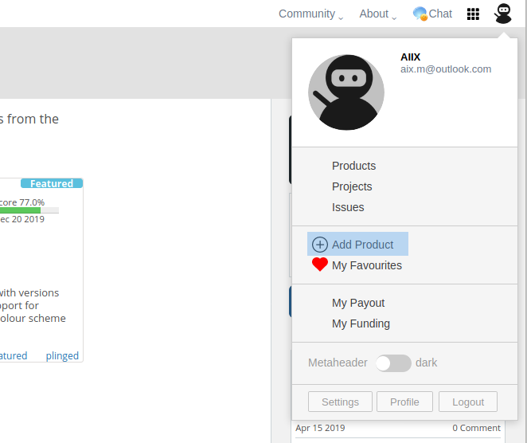
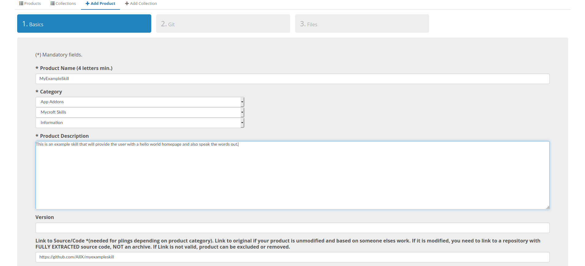
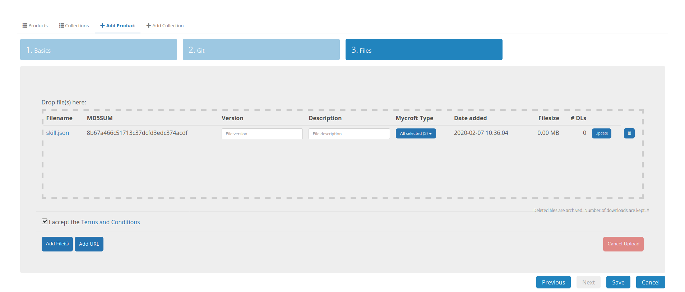

## Plasma-Bigscreen Voice Application Development Guidelines

- [Plasma-Bigscreen Voice Application Development Guidelines](#plasma-bigscreen-voice-application-development-guidelines)
  - [Abstract](#abstract)
  - [Developing a skill for Mycroft AI](#developing-a-skill-for-mycroft-ai)
    - [Skill Structure](#skill-structure)
    - [Skill Sample ___init_ __.py file](#skill-sample-init-py-file)
  - [Adding a Graphical User Interface to the skill](#adding-a-graphical-user-interface-to-the-skill)
    - [Skill Sample example.qml file](#skill-sample-exampleqml-file)
  - [Converting a GUI Skill to a Voice Application](#converting-a-gui-skill-to-a-voice-application)
    - [Creating an entry point / homepage for your GUI skill](#creating-an-entry-point--homepage-for-your-gui-skill)
    - [Creating a desktop file for your skill](#creating-a-desktop-file-for-your-skill)
  - [Adding your Voice Application to the Mycroft Skill Installer](#adding-your-voice-application-to-the-mycroft-skill-installer)
    - [The "skill.json" file](#the-%22skilljson%22-file)
    - [Adding you application to the Pling Store](#adding-you-application-to-the-pling-store)

### Abstract

All Voice Applications for Mycroft AI, start out as simple voice skills with a graphical user interface. This documentation will provide you with all the basics of creating new voice applications and also converting your exsisting voice skills or gui skills to complete voice applications.

This tutorial requires Mycroft-Core, Mycroft-GUI and Mycroft-Skill-Installer. We are in this tutorial going to create a graphic user interface skill for Mycroft-AI which can be installed as a Voice Applications on the Plasma Bigscreen Platform.

### Developing a skill for Mycroft AI

Skills for Mycroft are written using the Python programming language. Creating a skill requires at least basic python experience, a mycroft installation or device, and an idea of what your skill will do, and how people will use it.

We will showcase a simple hello-world example skill below.

#### Skill Structure

- “myexampleskill” should be replaced with name of your skill
- “authorname” should be replaced with your git repository username 

Your directory structure should now be as follows:

``` myexampleskill.authorname/__init__.py
myexampleskill.authorname/requirements.txt
myexampleskill.authorname/dialog/en-us/example-speak.dialog
myexampleskill.authorname/vocab/en-us/example-one.voc
myexampleskill.authorname/ui/example.qml
myexampleskill.authorname/res/desktop/myexampleskill.desktop
myexampleskill.authorname/res/desktop/myexampleskill_icon.png
myexampleskill.authorname/res/desktop/skill.json
```

#### Skill Sample ___init_ __.py file
This file is where most of the Skill is defined using Python code. This file will be referenced through out this tutorial as we move along different sections of this tutorial.

To learn more in-depth about concepts of Vocab, Dialogs and creating Mycroft AI skills refer to: https://mycroft-ai.gitbook.io/docs/skill-development/introduction

```
import sys
from adapt.intent import IntentBuilder
from mycroft import MycroftSkill, intent_handler

class MyExampleSkill(MycroftSkill):

def __init__(self):
    super().__init__("MyExampleSkill")

def initialize(self):
    self.add_event('myexampleskill.authorname.home', self.homepage)
    self.gui.register_handler("ExampleSkill.ButtonClicked", self.handleButtonClick)

def homepage(self):
    self.gui['exampleText'] = "Hello World"
    self.gui.show_page("example.qml")
    self.speak("Welcome To Hello World")

@intent_handler('handle_example_helloWorld').require('example-one')
def handle_example_helloWorld(self, message):
    self.gui['exampleText'] = "Hello World"
    self.gui.show_page("example.qml")
    self.speak("Welcome To Hello World")

def handleButtonClick(self):
    self.speak_dialog("example-speak")

def stop(self):
    pass

def create_skill():
    return MyExampleSkill()
```

### Adding a Graphical User Interface to the skill

Skill Graphical User Interfaces are written using QML user interface markup language.

#### Skill Sample example.qml file

This file is where one can design the UI for the skill, the skill can have multiple pages or a single page to display. 

- A skill page can be called from the Mycroft Skill with ***self.gui.show_page(*pagename*)*** where *pagename* is replaced by the page that you want to display
- Skill page can be provided data from the skill with ***self.gui['exampleText'] = 'Hello World'*** where *exampleText* key, value is replaced by the data you want to show on your skill page

For more in-depth tutorial on creating skill graphical user interfaces, understanding Mycroft-GUI modules, available delegates and more detailed examples refer to: https://mycroft-ai.gitbook.io/docs/skill-development/displaying-information/mycroft-gui

```
import Mycroft 1.0 as Mycroft

Mycroft.Delegate {

    ColumnLayout {
        anchors.fill: parent

        Label {
            id: labelId
            Layout.fillWidth: true
            Layout.preferredHeight: Kirigami.Units.gridUnit * 4
            text: sessionData.exampleText           
        }

        Button {
            id: buttonExample
            Layout.fillWidth: true
            Layout.preferredHeight: Kirigami.Units.gridUnit * 2
            text: "Speak"
            onClicked: triggerGuiEvent("ExampleSkill.ButtonClicked", {})
        }
    }
}
```
### Converting a GUI Skill to a Voice Application 

Mycroft voice skills with a GUI can easily be converted to a Voice Application by adding the following to your skill:

- A homepage entry point: a main page to the skill that can show an inital page of the skill or list of voice commands a skill can use for example when the voice application is started

- Desktop File: defines the skill as an voice application with an entry point 

```
myexampleskill.authorname/res/desktop/myexampleskill.desktop 
```
- Voice Application Icon: icon for the voice application

```
myexampleskill.authorname/res/desktop/myexampleskill_icon.png
```
- Skill.json: required for uploading to the store and making the voice application available to the skill installer
```
myexampleskill.authorname/res/desktop/skill.json
```

#### Creating an entry point / homepage for your GUI skill

Homepage for skills is the starting point of an voice application, In the example below we see the corresponding function defined in the __init_ _.py file that is called when the application is opened.

*part of the __init_ _.py example above*

```
def initialize(self):
    ### 
    - Adding an event to the skill to display the homepage when start voice application event is sent by mycroft-gui
    - The start event will always be called "yourskillname.authorname.home"
    - In this example the event is liked to a function defined: self.homepage
    ###

    self.add_event('myexampleskill.authorname.home', self.homepage)
    ...

def homepage(self):
    ###
    - Function called when asked to display homepage
    - Sends sample data 'exampleText' to hompage
    - Shows the 'example.qml' file as the homapage
    - Speaks the welcome message
    ###

    self.gui['exampleText'] = "Hello World"
    self.gui.show_page("example.qml")
    self.speak("Welcome To Hello World")

```

#### Creating a desktop file for your skill

The desktop file provides the application launcher with all the information about the voice application, it also defines the starting entry point of the skill.

The desktop file can be customized as per the skill authour / application developers requirements, but the desktop file must contain the following keys and values for the voice application to launch correctly:

- Exec: This contains how the voice application will be executed, All voice applications are executed inside of the Mycroft GUI skillview and hence are required to start using the following exec:

```
Exec=mycroft-gui-app --hideTextInput --skill=myexampleskill.authorname.home
```
- Categories: This contains the application category the voice application is part of, to display it correctly under the voice applications section, the value of this category must be set to:

```
Categories=VoiceApp
```

- StartupNotify: As the voice application is started inside the mycroft-gui skill view the generic desktop version of startup notifications do no work with voice applications and hence must always be disabled or set to false to avoid empty windows from being created

A Complete example of how a desktop file must be formatted for the voice application:

```
[Desktop Entry]
Terminal=false
Type=Application
Name=MyExampleSkill
Exec=mycroft-gui-app --hideTextInput --skill=myexampleskill.authorname.home
Icon=myexampleskill_icon
Categories=VoiceApp
StartupNotify=false
X-DBUS-StartupType=None
X-KDE-StartupNotify=false
```

### Adding your Voice Application to the Mycroft Skill Installer

Voice Applications currently can only be installed using the Mycroft Skill Installer, the Mycroft Skill Installer requires the Voice Application to be uploaded to the Pling Store and also to a git repository in order to be available inside the installer. 

#### The "skill.json" file

Let's look at an example skill.json file required to be uploaded to the "Files" section in the add product page of the pling store:

```
{
    "name": "Youtube Skill",
    "skillname": "youtube-skill",
    "authorname": "aiix",
    "foldername": "",
    "url": "https://github.com/AIIX/youtube-skill",
    "branch": "master",
    "desktopFile": true,
    "warning": "",
    "examples": [
        "Youtube metallica",
        "Youtube paradise city by guns and roses",
        "Pause youtube",
        "Resume youtube"
    ]
} 
```

- **name (Value Required)**: The name of the skill as it would show up on the skill installer
- **skillname (Value Required)**: The name of the skill folder which should match the skill name
- **authurname (Value Required)**: The username of the author where the skill repository is uploaded
- **foldername (Value Optional)**: The foldername of an orignal mycroft skill that the current skill is replacing (this is required only when replacing a default skill installed by mycroft for example your weather skill replacing the mycroft-weather.mycroftai skill)
- **url (Value Required)**: The git repository url where the skill is uploaded
- **branch (Value Required)**: The branch inside the git repositry for checkout
- **desktopFile (Value Required)**: This value must be set as true if this voice application is to be displayed under voice applications, it can also be set to false for voice based mycroft skills that aren't complete voice applications
- **warning (Value Optional)**: provides a message to the user incase the author decides to mark the skill as unstable or work in progress
- **examples (Value Required)**: This field populates the voice commands of the skill / voice application inside the Mycroft Skill Installer

#### Adding you application to the Pling Store

The Pling Store is a publishing platform for open source applications, addons, wallpapers, applets and more. The Mycroft Skill Installer leverages the infrastructure provided by the pling store to make installing voice applications a breeze.

- Create an account on https://www.pling.com/
- Start by adding a new product:



- Under add products, fill out the following required information:
    - Product Name: The name of your voice application as you would like it to appear on the Mycroft Skills Installer
    - Category: App Addons
    - Sub Category: Mycroft Skills
    - Sub Category: Can be a selection from Configuration, Entertainment, Information, Productivity
    - Product Descriptiton: A short description on what the voice application/skill does
    - Link to Source/Code: Link to the git repository where the application/skill have been uploaded
    - License: Select the license the code is available under
    - Logo: An image icon representing your skill



- Upload the skill.json file under Files in the add product page



- Save the added product

The voice application should show up under the Mycroft Skill Installer as soon as the server has finished updating, ETA: ~60 minutes